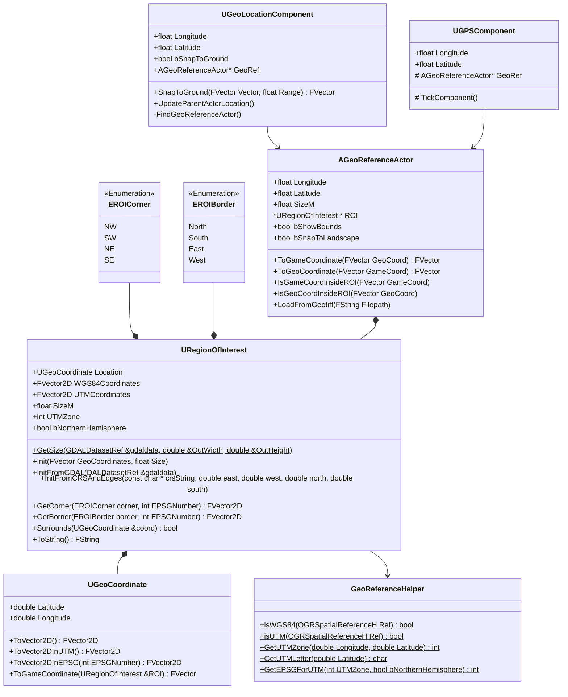

## Class Overview

```mermaid
classDiagram
    URegionOfInterest*--UGeoCoordinate
    EROICorner--*URegionOfInterest
    EROIBorder--*URegionOfInterest
    URegionOfInterest-->GeoReferenceHelper

    AGeoReferenceActor*--URegionOfInterest
    UGeoLocationComponent-->AGeoReferenceActor
    UGPSComponent-->AGeoReferenceActor

    class UGeoCoordinate{
        +double Latitude
        +double Longitude
        +ToVector2D() FVector2D
        +ToVector2DInUTM() FVector2D
        +ToVector2DInEPSG(int EPSGNumber) FVector2D
        +ToGameCoordinate(URegionOfInterest &ROI) FVector
    }

    class EROICorner {
        <<Enumeration>>
        NW
        SW
        NE
        SE
    }

    class EROIBorder {
        <<Enumeration>>
        North
        South
        East
        West
    }

    class URegionOfInterest{
        +UGeoCoordinate Location
        +FVector2D WGS84Coordinates
        +FVector2D UTMCoordinates
        +float SizeM
        +int UTMZone
        +bool bNorthernHemisphere
        +GetSize(GDALDatasetRef &gdaldata, double &OutWidth, double &OutHeight)$
        +Init(FVector GeoCoordinates, float Size)
        +InitFromGDAL(DALDatasetRef &gdaldata)
        +InitFromCRSAndEdges(const char * crsString, double east, double west, double north, double south)
        +GetCorner(EROICorner corner, int EPSGNumber) FVector2D
        +GetBorner(EROIBorder border, int EPSGNumber) FVector2D
        +Surrounds(UGeoCoordinate &coord) bool
        +ToString() FString
    }

    class GeoReferenceHelper {
        +isWGS84(OGRSpatialReferenceH Ref)$ bool
        +isUTM(OGRSpatialReferenceH Ref)$ bool
        +GetUTMZone(double Longitude, double Latitude)$ int
        +GetUTMLetter(double Latitude)$ char
        +GetEPSGForUTM(int UTMZone, bool bNorthernHemisphere)$ int
    }

    class AGeoReferenceActor {
        +float Longitude
        +float Latitude
        +float SizeM
        *URegionOfInterest * ROI
        +bool bShowBounds
        +bool bSnapToLandscape
        +ToGameCoordinate(FVector GeoCoord) FVector
        +ToGeoCoordinate(FVector GameCoord) FVector
        +IsGameCoordInsideROI(FVector GameCoord)
        +IsGeoCoordInsideROI(FVector GeoCoord)
        +LoadFromGeotiff(FString Filepath)
    }

    class UGeoLocationComponent{
        +float Longitude
        +float Latitude
        +bool bSnapToGround
        +AGeoReferenceActor* GeoRef;
        +SnapToGround(FVector Vector, float Range) FVector
        +UpdateParentActorLocation()
        -FindGeoReferenceActor()
    }

    class UGPSComponent{
        +float Longitude
        +float Latitude
        # AGeoReferenceActor* GeoRef
        # TickComponent()
    }
```
